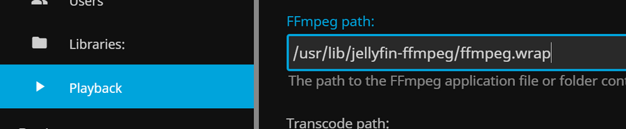
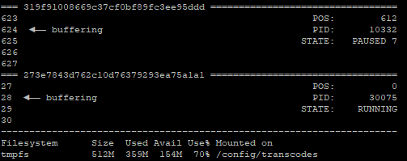

# Jellyfin-Transcodes-cleanup
Cleanup script for autonomous cleanup of [Jellyfin media server](https://github.com/jellyfin/jellyfin) transcodes directory.
The script works with both - transcoding enabled or disabled, in Jellyfin settings (Server -> Playback).

## What problem it addresses?
When using RAM drive for mounting the transcodes directory then the free space is limited (eg, to 1GB). When the directory is getting full (out of free space) then FFMPEG will create 0 size files, which will cause the playback to stall.

Jellyfin version 10.8.9 has very limited transcoding space management. For example, it will remove files when the client has finished playback, but probably nothing more. FFMPEG process which is started by Jellyfin server to perform the transcoding, will generate files in transcodes directory until whole movie is processed, regardless of the current playback position of the client.

Every user can have different available space configuration for transcodes directory, and the number of parallel users that will be watching media content. Therefore this cleanup script was created to perform calculation of available space per each active client, and control the FFMPEG process by pausing and resuming or restarting as necessary to ensure optimal space usage and avoid running out of free space.

## Features
- Monitor used and free space in transcodes directory
- Maintain TS files in transcodes directory at optimal number guiding by the free space available, and other active TS segments (Jellyfin clients)
- Create PID file for each TS segment (each Jellyfin client)
- Monitor TS file which is currently being accessed/buffered (the file has Last Accessed > Last Modified)
- Delete TS files which were already buffered (keeping the previous and currently buffered TS files)
- Monitor playback position change
- Monitor if TS files are following sequential sequence (1, 2, 3, ...)
- Calculate allowed space for each TS segment, depending on the total number of active segments
- TS segments with larger file size get proportionally larger allowed space compared to other TS segments
- Pause FFMPEG process (stop writing to TS files) if total size of TS files for segment exceeds allowed space
- Delete last created TS files if total size of TS files for segment considerably exceeds allowed space, and there is less than 15% of free space remaining in transcodes directory
- Restart FFMPEG process when buffering is approaching a deleted TS file (FFMPEG will continue to create TS files starting with deleted one)
- Monitor and delete obsolete TS files in transcodes directory
- Delete 0-size files (if they were not accessed for more than 3 seconds)
- When Jellyfin is transcoding to a single MP4 file then script will terminate FFMPEG process to force Jellyfin to fallback to other format (because space consumption of MP4 cannot be managed)
- Logging at five different levels can be configured - OFF, Warning, Information, Debug, Trace
- Cleanup script log file can be written to Jellyfin log directory and accessed from Jellyfin UI
- There is included a script **bufmon.sh** which can be used to manually monitor TS files in transcoding directory to ensure proper operation of the cleanup script
- Maintenance activities:
     - Truncate TS files which were deleted, but still consume space in transcodes directory (this is possible in some cases when system is holding a deleted file in /proc/*/fd)
     - Kill FFMPEG processes which were earlier paused and abandoned
     - Truncate cleanup script log file when it reaches 10 MB
     - Maintenance of array variables internally used by cleanup script
     - Shutdown cleanup script if there is no TS segment appearing for given time period (1 hour)

## Credits

Idea of creating FFMPEG WRAP is taken from comment by **ManuLinares** here:
https://github.com/jellyfin/jellyfin/issues/1986#issuecomment-1019555157

Pausing and resuming FFMPEG process (using SIGSTOP and SIGCONT signals) was implemented following suggestion by **vgarleanu** in this post
https://github.com/jellyfin/jellyfin/issues/2919#issuecomment-890036650.

## Other notes on operation:
- In order to launch the cleanup script it is recommended to configure FFMPEG WRAP script (instructions are given in setup/configure section)
- Cleanup script will be launched every time when Jellyfin client starts playback or playback position is changed
- If there is an active cleanup script instance running, then all subsequently launched Cleanup script processes will exit, leaving only one instance running
- Cleanup script is launched detached from the parent (meaning that it is detached from FFMPEG WRAP process)
- Original argument passed by Jellyfin to FFMPEG is **-threads 0**. FFMPEG WRAP will change it to **-threads 1** as this results in less spanned FFMPEG child processes thus it will slower fill up space in transcodes directory, however tests show that the cleanup script will work the same regardless if is **-threads 0** or **-threads 1**.

## How to setup/configure
1. Create new directory and download files from repository
   Note: do this with the same user that is running Jellyfin, for Docker container use: `docker exec -it container_name bash`
2. Grant execute permission:
   ```
   chmod +x /config/ffmpeg/transcode.cleanup.sh
   chmod +x /config/ffmpeg/ffmpeg.wrap
   ```
3. Update variables for respective directory paths in **ffmpeg.wrap** and **transcode.cleanup.sh** (and **bufmon.sh* - if it will be used):

     _Required configuration:_

     | VARIABLE | ffmpeg.wrap | transcode.cleanup.sh | bufmon.sh | PURPOSE |
     | --- | :---: | :---: | :---: | --- |
     | FFMPEG_DIR	| X	| X |	X |	Full path to directory that was created in step 1. |
     | TRANSCODES_DIR	| X |	X |	X	| Full path to transcodes directory |
     | SEMAPHORE_DIR |	X |	X |	X |	Full path to directory which will be used to store semaphore/flag files to by the cleanup script |
     | LOG_DIR | X | X | - | Full path to directory which will contain the cleanup script log file |
     | CLEANUP_PROG |	X |	- |	- |	Full path to **transcode.cleanup.sh** file |

     _Optional configuration:_
     
     | VARIABLE | ffmpeg.wrap | transcode.cleanup.sh | PURPOSE |
     | --- | :---: | :---: | --- |
     | CLEANUP_LOG_MAXSIZE | - | X | Maximum size of the log file reaching which the log file will be truncated (default is 10485760 bytes=10 MB) |
     
     _**Note:** there are many more variables possible to configure in **transcode.cleanup.sh**, purpose of those is given in the script file itself._
     
4. Install required Unix/Linux packages:
     For Jellyfin in Docker container which is running on Debian:
     ```
     apt update
     apt install htop
     apt install procps
     ```
     _**Note:** htop is optional - it can view parent-child system processes in a tree view (press `t` on keyboard)_
5. Configure Jellyfin to use FFMPEG WRAP script instead of original FFMPEG binary:
     
     
6. Optimize for your server

     If your server is not using graphics card for hardware transcoding then the process for producing TS files may be too slow and you need to update some global variables in **transcode.cleanup.sh** to tweak the time intervals for various monitoring activities that the script is performing. Refer to issue https://github.com/RTUnit/Jellyfin-Transcodes-cleanup/issues/1 for instructions.

## Monitoring
Included script **bufmon.sh** provides possibility to monitor TS files in transcodes directory and ensure proper operation of cleanup script.

Below screenshot shows bufmon.sh displaying two parallel clients streaming TS files - one is buffering file `319f91008669c37cf0bf89fc3ee95ddd`**624**`.ts` and the other `273e7843d762c10d76379293ea75a1a`**128**`.ts`. Also it shows the total used space in `/config/transcodes` directory for both clients is 70% from 512MB of total space. FFMPEG for the first client is paused for 7 seconds and the other is running (generating TS files).



Start bufmon from command line:
```
. bufmon.sh
```

## Stopping the cleanup process
It may be necessary to forcefully terminate cleanup process, for example, to re-launch **transcode.cleanup.sh** after adjusting configuration variables inside the script.

In order to signal the script to terminate, perform following command: touch `$SEMAPHORE_DIR/transcode.cleanup.stop`
, where `$SEMAPHORE_DIR` is the full path to directory containing semaphore files.

## Starting cleanup script manually
If the cleanup script is failing and log file is not providing sufficient information to understand reasons, then you can start it manually from terminal window:
```
. transcode.cleanup.sh 1 4
```
Above command will start the script in TRACE mode (indicated by argument 4). The first argument indicates if timestamps need to be printed to the log file (can be 0 or 1).

**Note:** If another instance of cleanup script is running then manually started process will immediately exit. Refer to above instructions to first stop the running process and only then start it manually.

If the script has syntax problem then it should be printed in the terminal window, indicating the line number. If you made changes to the particular line number then try to revert these changes and re-run the script again. The process may exit or continue running so you have to check if stopping the script is required before starting again.

## Sample Docker command
This Docker command will create [Jellyfin v10.8.9 official container](https://hub.docker.com/r/jellyfin/jellyfin) using RAM drive for transcoding directory for QNAP NAS with NVIDA graphics card:
```
GPU=nvidia0 gpu-docker run -d --init --name jellyfin \
 --user 1000:100 \
 --net=host \
 --volume /some-directory/config:/config \
 --volume /some-directory/cache:/cache \
 --restart=unless-stopped \
 --device /dev/dri/renderD128:/dev/dri/renderD128 \
 --device /dev/dri/card0:/dev/dri/card0 \
 --no-healthcheck \
 -e VERSION=docker \
 -e NVIDIA_VISIBLE_DEVICES="all" \
 -e NVIDIA_DRIVER_CAPABILITIES="all" \
 -e PATH="/usr/local/sbin:/usr/local/bin:/usr/sbin:/usr/bin:/sbin:/bin:/usr/lib/jellyfin-ffmpeg" \
 -e LD_LIBRARY_PATH="/usr/local/cuda/extras/CUPTI/lib64:/usr/local/nvidia/lib:/usr/local/nvidia/lib64" \
 -e JELLYFIN_FFMPEG="/usr/lib/jellyfin-ffmpeg/ffmpeg.wrap" \
 --mount type=tmpfs,destination=/config/transcodes,tmpfs-size=536870912 \
 --mount type=tmpfs,destination=/config/log,tmpfs-size=104857600 \
 --mount type=tmpfs,destination=/config/semaphore,tmpfs-size=10485760 \
jellyfin/jellyfin:10.8.9 \
&& docker exec -it -u 0 jellyfin ln -sf /config/ffmpeg/ffmpeg.wrap /usr/lib/jellyfin-ffmpeg/ffmpeg.wrap \
&& docker exec -it -u 0 jellyfin ln -sf /usr/lib/jellyfin-ffmpeg/ffprobe /usr/lib/jellyfin-ffmpeg/ffprobe.wrap \
&& docker exec -it -u 0 jellyfin apt update \
&& docker exec -it -u 0 jellyfin apt -y install htop \
&& docker exec -it -u 0 jellyfin apt -y install procps
```
`/config/transcodes` is configured with 512MB RAM

`/config/log` is configured with 100MB RAM (optional)

`/config/semaphore` is configured with 10MB RAM (optional - used for flag files by cleanup script)

**Don't forhet to create dedicated user to run Jellyfin process.** (here it is user 1000 of group 100)

**Don't forget to add your media folder.**

**Note:** `htop` process installation is optional, but `ps` (procps) is required.

**Note:** `--init` argument is used to efficiently remove orphan FFMPEG zombie processes that otherwise will pile-up in system process table in the container.

## Possible further improvements
- Display message to user when there is insufficient space for TS files (for example, when too many simultaneous clients do playback) - the idea was to generate custom      TS file from cleanup script with overlay text which would be automatically red by the client, however problem with HLS files is that they contain a lot of HLS metadata which is required by hls.js in Jellyfin client (for example, to ensure the proper sequence number and length of the fragment).
